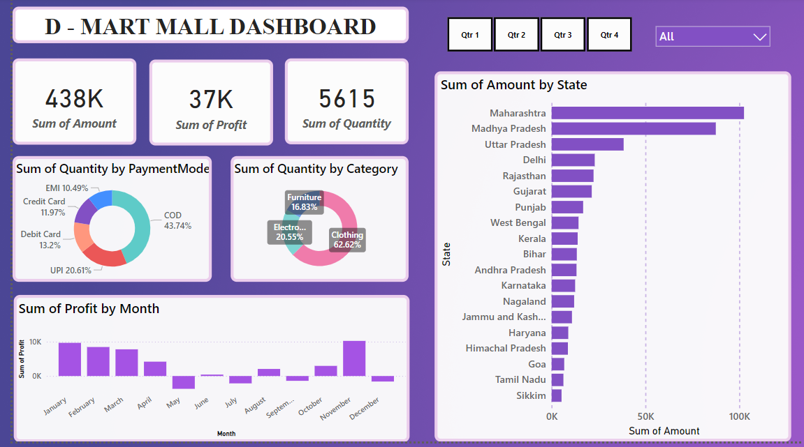

# D-Mart Mall Dashboard

A learning-based Power BI project built using an online sample dataset.
This dashboard focuses on analyzing retail sales performance across states, categories and time periods, and demonstrates key data visualization and analytics skills.

---

## 📂 Dataset Source

The dataset used in this project was obtained from an online sample source and contains two sheets/files:

* `dmart_details.xlsx`
* `dmart_orders.xlsx`

> *Note: The dataset is included in the **`dataset/`** directory of this repository.*

---

## 🎯 Project Objectives

* Practice and improve Power BI dashboard development skills
* Apply data cleaning, transformation and modeling techniques
* Build interactive visualizations for sales insights
* Explore trends and patterns for data-driven decision making

---

## 🔍 Key Insights

| Metric                     | Result/Observation                       |
| -------------------------- | ---------------------------------------- |
| **Total Sales**            | 438 K                                    |
| **Total Profit**           | 37 K                                     |
| **Total Quantity Sold**    | 5615                                     |
| **Top Performing State**   | Maharashtra (followed by Madhya Pradesh) |
| **Preferred Payment Mode** | Cash on Delivery (43.74%)                |
| **Best-Selling Category**  | Clothing (62.62%)                        |
| **Seasonal Trend**         | Higher profits in Q1 and December        |

---

## 🛠️ Techniques Used

* Data cleaning and transformation
* DAX calculations for custom metrics
* Interactive filters and slicers
* Chart/visual selection based on KPI type
* Dashboard design and layout

---

## ▶️ How to View / Run

1. Clone or download this repository.
2. Open the file `dmart_dashboard.pbix` in **Power BI Desktop**.
3. Refresh the data if prompted.
4. Explore the dashboard and interact with the filters/slicers to view different insights.

---

> ✨ **Dashboard Preview**  
> 

---
